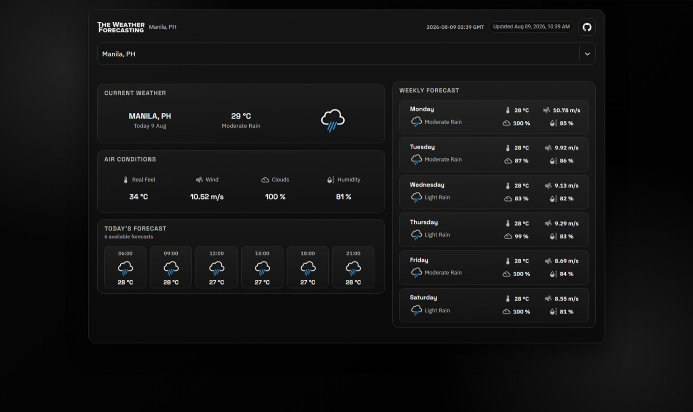

<br/>
<br/>

With [The Weather Forecasting](https://the-weather-forecasting-raven-black.vercel.app/) user can search locations by city name and observe the weather for the next 5-6 days and 3 hour interval.
<br />
The app is developed using React.js and material-UI.

<br/>

## 💻 Live Demo:

https://the-weather-forecasting-raven-black.vercel.app/

<br/>

## ✨ Getting Started

- Make sure you already have `Node.js` and `npm` installed in your system.
- You need an API key from [OpenWeatherMap](https://openweathermap.org/). After creating an account, [grab your key](https://home.openweathermap.org/api_keys).
- Create a `.env` file in the project root and add `REACT_APP_OPENWEATHER_API_KEY=your_api_key_here`.
- The weather API integration lives in `src/api/OpenWeatherService.js`.

<br/>

## ⚡ Install

- Clone the repository:

```bash
git clone https://github.com/Amin-Awinti/the-weather-forecasting.git

```

- Install the packages using the command `npm install`

<br/>

## 📙 Used libraries

- `react-js`
- `material-ui`

Check `packages.json` for details

<br/>

## 📄 Todos

- [ ] Styled-components
- [ ] Convert the entire project to TypeScript
- [ ] Unit Testing
- [ ] On launch, find user location weather by utilizing GeolocationAPI/GEOCODING
- [ ] Celcius/Fahrenheit conversion
- [ ] Dark/Light Mode

<br/>
Thank You ☺
